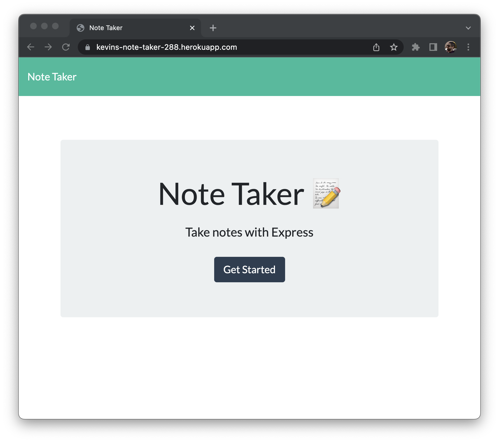
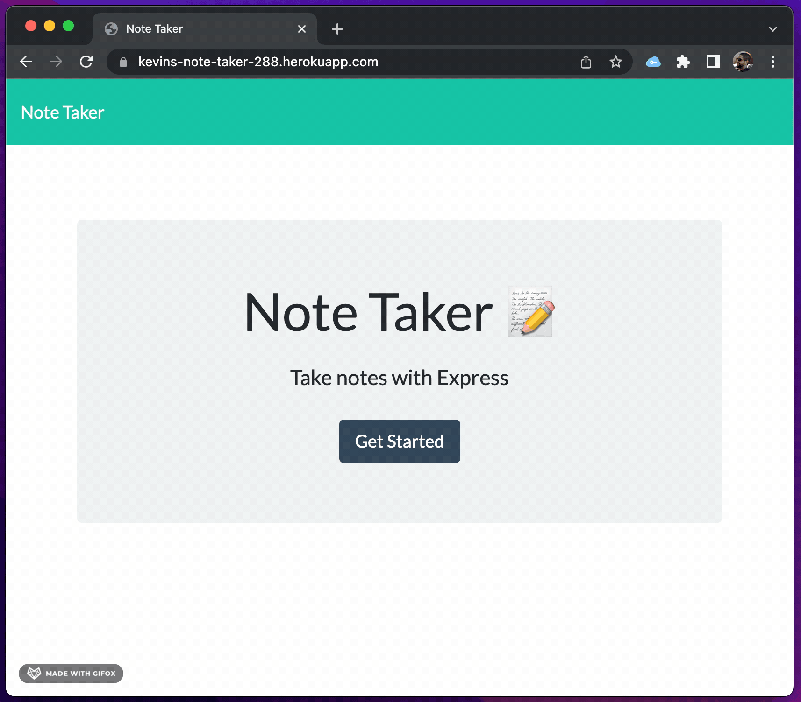
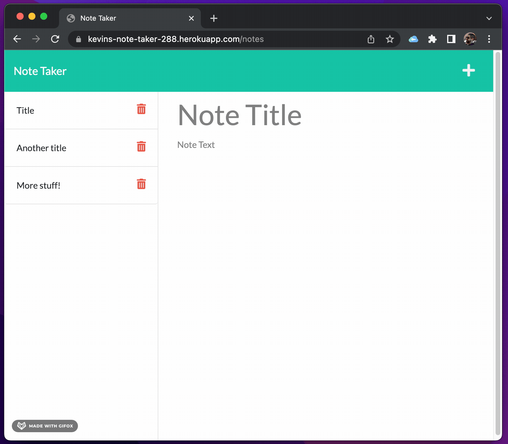

# Kevin's Note Taker 

## Description
This app is designed to keep track of notes! it's an example of express.js, json storage and some cool full stack features! The focus being on Express.js, as it allows a great way to manage the path for your web routes.

## Table of Contents
* [Description](#description)
* [Technology](#technology)
* [Deployed](#deployed)
* [Questions](#questions)

## Technology
* HTML, CSS, Javascript
* Node.js
* JSON
* Express.js
* Heroku

## Deployed
Check out the site here! you can see for yourself on Heroku!  
https://kevins-note-taker-288.herokuapp.com

## Questions
For questions, reach me at my github: https://github.com/kh288